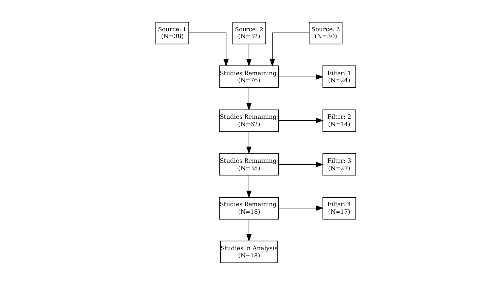

<!-- README.md is generated from README.Rmd. Please edit that file -->

# prismadiagramR

<!-- badges: start -->

[](https://travis-ci.org/ltrainstg/prismadiagramR)
[](https://ci.appveyor.com/project/ltrainstg/prismadiagramR)
[](https://CRAN.R-project.org/package=prismadiagramR)
[](https://www.tidyverse.org/lifecycle/#experimental)
[](https://codecov.io/gh/ltrainstg/prismadiagramR?branch=master)
<!-- badges: end -->

The goal of prismadiagramR is to create a custom prismadiagram in R.

## Installation

You can install the released version of prismadiagramR from
[CRAN](https://CRAN.R-project.org) with:

``` r
install.packages("prismadiagramR")
```

And the development version from [GitHub](https://github.com/) with:

``` r
# install.packages("devtools")
devtools::install_github("ltrainstg/prismadiagramR")
```

## Example

This is a basic example which shows you how to solve a common problem:

``` r
library(prismadiagramR)
getAutoPRISMA(prismaExampleInput)
```

``` r

set.seed(25)
N <- 100
studyStatus <- data.frame(Pub.ID = seq(1:N), 
                          Source = sample(1:3, N, replace = TRUE),
                          Filter = sample(1:5, N, replace = TRUE))
studyStatus$Filter[studyStatus$Filter==5] <- NA  

getPrisma(studyStatus) %>% DiagrammeR::grViz(.)
#> Warning in getPrisma(studyStatus): prismaFormat is null so attempting to
#> make automatic one from studyStatus
#> Warning in getFormatNode(studyStatus, prismaFormat): fontSize param not
#> passed in prismaFormat
```



## Other PRISMA resources

A few other R packages exsit that also make prisma diagram, but these
either lack the flexibility or ease of use as this package.

<https://cran.r-project.org/web/packages/PRISMAstatement/vignettes/PRISMA.html>
<https://rdrr.io/cran/metagear/man/plot_PRISMA.html>

## Package Development Resources

This package was developed following these guides:

  - John Muschelli’s r package development 1
    [HERE](https://www.youtube.com/watch?v=79s3z0gIuFU)
  - <https://sahirbhatnagar.com/rpkg/#tests>
